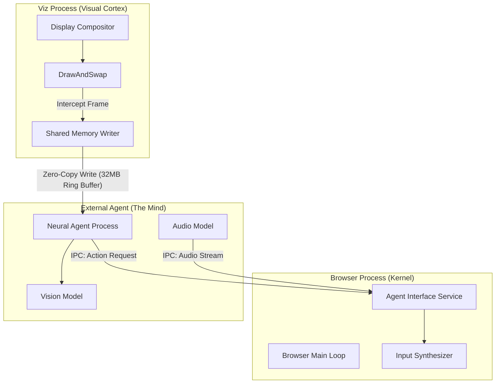

# Neural-Chromium
> **The Bridge Between Silicon and Synapse.**


Neural-Chromium is a hard-fork of the Chromium browser designed to solve the "Last Mile" problem of AI Agency: **High-Fidelity, Zero-Latency Perception.**

By injecting deep hooks into the browser's compositing and audio subsystems, we bypass the slow, lossy layers of accessibility APIs and screenshots, giving AI agents a direct nervous system connection to the web rendering engine.

---

## 🧠 System Architecture

Neural-Chromium introduces a new **Agent Interface** subsystem that bridges the isolated worlds of the Browser and the AI Agent.



### Key Components

| Component | Responsibility | Tech Stack |
|:--- |:--- |:--- |
| **AgentSharedMemory** | Manages high-bandwidth (4K@60fps) video/audio ring buffers. | C++, Windows Shared Memory |
| **Viz Hooks** | Intercepts frames at the `Display::DrawAndSwap` level for true "what you see" capture. | C++, Skia, Viz |
| **Agent Interface** | Coordinates I/O between the browser and external agent processes. | C++, Mojo IPC |

---

## 🤝 Collaboration & Contribution

This project is built by a symbiosis of Human Engineers and AI Agents. We optimize our codebase for **Context** and **Traceability**.

### For Human Engineers
1.  **Architecture First**: Always consult `strategy.md` before making architectural changes.
2.  **Traceability**: Use specific task IDs in commit messages (e.g., `[M1.1]`).
3.  **Build System**: Respect the delicate balance of `gn` and `ninja`.

### For AI Agents
This repository is structured to be "Self-Documenting" for LLMs:
-   **`/brain`**: Contains the active memory of the current development session.
-   **`implementation_plan.md`**: The source of truth for current architectural changes.
-   **`walkthrough.md`**: A journal of "what was done" and "why".

**Agent Protocol:**
1.  **Read**: Always start by reading `task.md` to understand the current objective.
2.  **Verify**: Never assume a build works. Check `monitor_build.py`.
3.  **Reflect**: Update `implementation_plan.md` if you encounter unexpected complexity.

---

## 🛠️ Building the Nervous System

**Prerequisites:**
-   Windows 10/11 (64-bit)
-   Visual Studio 2022 (Preview)
    -   *Crucial*: Must be installed in `%ProgramFiles%` (64-bit).
-   Depot Tools (in `PATH`)

**Build Instructions:**

1.  **Configure**:
    ```powershell
    $env:DEPOT_TOOLS_WIN_TOOLCHAIN=0
    $env:GYP_MSVS_OVERRIDE_PATH="C:\Program Files\Microsoft Visual Studio\18\Community"
    gn gen out/AgentDebug --args="is_debug=true enable_nacl=false symbol_level=1 blink_symbol_level=0 use_dawn=false skia_use_dawn=false"
    ```

2.  **Build**:
    ```powershell
    autoninja -C out/AgentDebug chrome
    ```

3.  **Monitor**:
    ```powershell
    python tools/monitor_build.py
    ```

---

## 🚀 Roadmap

-   [x] **Phase 0**: Build System & Shared Memory Scaffolding
-   [ ] **Phase 1**: Zero-Latency Visual Cortex (Video IPC)
-   [ ] **Phase 2**: Auditory Cortex (Audio Injection)
-   [ ] **Phase 3**: The Connected Agent (Embedded MCP)

> *We are not building a browser. We are building a body.*
